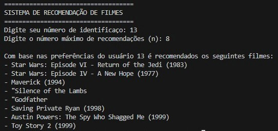

# Sistema de Recomendação de Filmes

**Base de Dados**
O sistema utiliza como base de dados dois arquivos de csv retirado da MovieLeans
- movies.csv
- rating.csv

Podem ser encontrados pelo link:
https://grouplens.org/datasets/movielens/

É utilizado o Algorítmo de Filtragem Colaborativa

Execução do sistema de recomendação de filmes
